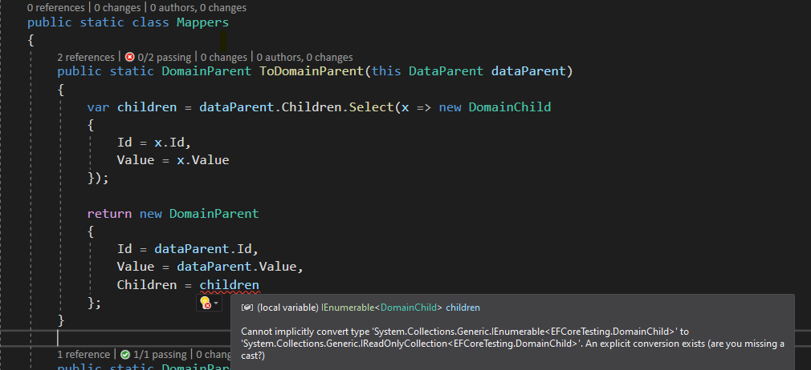

# Data to Domain Mapping Issue

```C#
        [Fact]
        public void Example_Scenario_Failing_Test()
        {
            var dataParent = new DataParent()
            {
                Id = "123",
                Value = "new",
                Children = new List<DataChild>() {
                    new DataChild()
                    {
                        Id = "1234",
                        Value = "new"
                    }
                }
            };

            var domainParent = dataParent.ToDomainParent();

            var child = domainParent.Children.FirstOrDefault();

            child.Value = "updated";

            Assert.Equal("updated", child.Value); // True
            Assert.Equal("updated", domainParent.Children.ElementAt(0).Value); // False
        }
```

We expect the objects to be the same and so both values should have been updated. What the hell is going on? Lets take a look at the `ToDomainParent` method.

```C#
        public static DomainParent ToDomainParent(this DataParent dataParent)
        {
            var children = dataParent.Children.Select(x => new DomainChild
            {
                Id = x.Id,
                Value = x.Value
            });

            return new DomainParent
            {
                Id = dataParent.Id,
                Value = dataParent.Value,
                Children = children
            };
        }
```

Ok, seems reasonable enough but if instead of assigning `Children = children` we do this... `Children = children.ToList()` all our problems go away.

```c#
 		[Fact]
        public void Example_Scenario_Passing_Test()
        {
            var dataParent = new DataParent()
            {
                Id = "123",
                Value = "new",
                Children = new List<DataChild>() {
                    new DataChild()
                    {
                        Id = "1234",
                        Value = "new"
                    }
                }
            };

            var domainParent = dataParent.MapToDomainParentCorrectly();

            var child = domainParent.Children.FirstOrDefault();

            child.Value = "updated";

            Assert.Equal("updated", child.Value); // True
            Assert.Equal("updated", domainParent.Children.ElementAt(0).Value); // True
        }
```

Why? Well turns out that if you don't `ToList` the `Select` statement you end up with the type `SelectListIterator<EFCoreTesting.DataChild, EFCoreTesting.DomainChild>` which implements `IEnumerable`. This means that when we call `Children.FirstOrDefault()` we re-evaluate the `Select` statement. Which is why if you call `FirstOrDefault` without `ToList` multiple times and compare the objects returned they will not be equal.

```c#
        [Fact]
        public void Call_First_Or_Default_More_Than_Once_Objects_Shoule_Be_The_Same_Failing_Test()
        {
            var dataParent = new DataParent()
            {
                Id = "123",
                Value = "new",
                Children = new List<DataChild>() {
                    new DataChild()
                    {
                        Id = "1234",
                        Value = "new"
                    }
                }
            };

            var domainParent = dataParent.ToDomainParent();

            var child = domainParent.Children.FirstOrDefault();
            var child2 = domainParent.Children.FirstOrDefault();

            Assert.True(child.Equals(child2)); // False
        }
```

This is a really easy trap to fall into and can cause a number of difficult to diagnose issues. So, is there a nice way to remember that we need to call `ToList` ? Yes, we if we ensure we don't expose `IEnumerable` in our domain objects and instead expose `ICollection`, `IReadonlyCollection `, `IList` or `IReadonlyList` we will get compile time errors if we don't call `ToList`.

